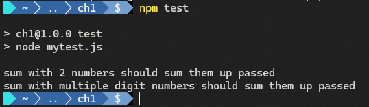
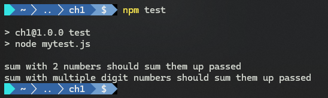

# 第 1 章 单元测试基础 The basics of unit testing


> **本章概要**
>
> - 确定 **入口点（*entry points*）** 和 **出口点（*exit points*）**
> - **单元测试** 与 **工作单元（*unit of work*）** 的定义
> - 单元测试与 **集成测试（*integration testing*）** 的区别
> - 单元测试的简单示例
> - 了解 **测试驱动开发（test-driven development）**


## 1.0 概述

本书预备知识：

1. 具有 `JavaScript` 及 `TypeScript` 基础，熟悉 `ECMAScript` 6 相关特性；
2. 熟练使用 `npm`；
3. 熟悉 `Git` 基础操作；

说明：

- JS 用于程序设计及函数式编程案例；
- TS 则用于面向对象相关的示例；
- 单元测试并不依赖于某种特定的编程语言。

GitHub 源码库：[https://github.com/royosherove/aout3-samples](https://github.com/royosherove/aout3-samples)


## 1.1 起步 The first step

很多人认为测试毫无用处，且浪费时间：笨拙、缓慢或无法维护。

弄清单元测试与集成测试的区别 **非常重要**。


## 1.2 剖析单元测试的含义 Defining unit testing, step by step

### 1 历史背景

单元测试于 **20 世纪 70 年代** 由 **Kent Beck** 在编程语言 `Smalltalk` 中首次引入，并成功推广到其他语言。它是开发人员提高代码质量、深入理解模块、类及函数等功能需求的最佳方法之一。


### 2 参考维基百科的定义

本书将部分参考维基百科中的单元测试定义（部分参考：因为少了很多关键细节的描述）——

> Unit tests are typically automated tests written and run by software developers to ensure that a section of an application (known as the “unit”) meets its design and behaves as intended. In procedural programming, a unit could be an entire module, but it is more commonly an individual function or procedure. In object-oriented programming, a unit is often an entire interface, such as a class, or an individual method ([https://en.wikipedia.org/wiki/Unit_testing](https://en.wikipedia.org/wiki/Unit_testing)).
>
> 单元测试通常是由软件开发人员编写和运行的自动测试，用于确保应用程序的某个部分（即“单元”）符合其设计并能按预期运行。在面向过程编程中，单元可以是整个模块，但更常见的是单个函数或过程；而在面向对象编程中，单元通常表示整个接口（如 `class` 类）或者单个方法（详见 [维基百科：Unit testing](https://en.wikipedia.org/wiki/Unit_testing)）。


### 3 测试的对象：SUT / CUT

编写测试的对象包括：**主题、系统或测试套件（subject, system, or suite under test，即 SUT）**。有时也称 **CUT（component, class, or code under test，即组件、类或被测代码）**。当进行某项测试时，测试针对的对象即 **SUT**。


### 4 工作单元的相关定义

单元：代表系统中的 **工作单元（unit of work）** 或者 **用例（use case）**。

**工作单元（unit of work）**：具有 **开始（beginning）** 与 **结束（end）**，分别称为 **入口点（entry point）** 与 **出口点（exit point）**。例如一个普通函数，可计算并返回某个值；由于计算过程可能涉及其他函数、其他模块甚至其他组件，因此 **工作单元**（从 **入口点** 到 **出口点**）可能并不仅仅涵盖一个函数。

> **定义**
>
> **工作单元** 是指从调用 **入口点** 开始，并通过一个或多个 **出口点** 实现明显的最终结果之间发生的所有操作。
>
> **工作单元** 是指在某个范围内发生的所有操作。该操作范围从调用 **入口点** 开始，并由一个或多个 **出口点** 产生的 **显著最终结果（noticeable end result）** 作为终点。
>
> **入口点** 是 **人为触发** 的。
>
>  例如，对于一个公共可见的函数而言：
>
> 1. 函数体：即 **工作单元** 的全部（或局部）；
> 2. 函数声明及签名：是进入该函数体的 **入口点**；
> 3. 函数输出结果或行为：即该函数的 **出口点**。


## 1.3 入口点与出口点

一个单元总是由 **一个出口点** 与 **一个或多个出口点** 组成：


**【图1 入口点与出口点相同时的情况】**

工作单元可以是——

- 单个函数
- 多个函数
- 多个模块
- 多个组件
- ……

只要是工作单位，必定有一个 **入口点**；同时也必定有要实现的有用功能（否则就没有存在的必要）。

所谓有用的功能，通常是指：返回值、状态变更、调用外部模块等。它们都可视为 **出口点**：


**【图 2 一个入口点对应三个出口点的情况】**

> 关于 **出口点** 的命名
>
> 之所以不用“行为”而用“出口点”，是因为行为更偏内源性，而这里强调的是调用方的外在可见的行为。“出口点”也很好地描述了当前控制出离工作单元上下文并返回测试上下文的过渡状态；而“行为”则更灵活多变。


### 1 示例1：入口点与出口点相同

对于以下函数：

```js
const sum = (numbers) => {
  const [a, b] = numbers.split(',');
  const result = parseInt(a) + parseInt(b);
  return result;
};
```

- 入口点：`sum(numbers)`（注意：不是 `numbers`）
- 出口点：`sum(numbers)`（同入口点）


**图 3 出口点为返回值的情况**

### 2 示例2：带全局状态的函数入口点与出口点

```js
let total = 0;
 
const totalSoFar = () => {
  return total;
};
 
const sum = (numbers) => {
  const [a, b] = numbers.split(',');
  const result = parseInt(a) + parseInt(b);
  total += result;
  return result;
};
```

- 入口点：`sum(numbers)`
- 出口点：共两个——
  - 原返回值；
  - 状态变更：产生累计总和、并能通过 `totalSoFar` 观察到。


**图 4 出口点带状态变更的情况**


### 3 示例3：存在依赖调用的函数入口点与出口点

```js
const winston = require('winston');

const makeLogger = () =>
  winston.createLogger({
    level: 'info',
    transports: new winston.transports.Console()
  });

let total = 0;
 
const totalSoFar = () => {
  return total;
};
 
const logger = makeLogger();
 
const sum = (numbers) => {
  const [a, b] = numbers.split(',');
  logger.info(  // A new exit point
    'this is a very important log output',
    { firstNumWas: a, secondNumWas: b });
 
  const result = parseInt(a) + parseInt(b);
  total += result;
  return result;
};
```

该 `sum` 函数有一个入口点、三个出口点：


**图 5 出口点带状态变更及第三方日志调用的情况**


## 1.4 出口点的类型

共三大类：

1. 返回一个有用的值（非 `undefined`）；
2. 调用前后，系统状态或行为发生了显著变化；
3. 调用了第三方系统（该测试无法控制）。

融合了 **入口点** 与 **出口点** 概念的 **单元测试** 的定义 —— 单元测试是这样一段代码：它调用某个 **工作单元**，并检查（check）作为该工作单元 **最终结果（end result）** 的某个具体 **出口点**。如果对最终结果的假设是错误的，则单元测试失败。单元测试的范围可以小到一个函数，也可以大到多个模块或组件，这取决于在 **入口点** 和 **出口点** 之间用了多少函数和模块。


## 1.5 出口点不同，用到的测试技术也不同

- 存在有效返回值的出口点：最简单；
- 存在状态变更的出口点：略有难度，需要先调用某项功能，然后调用另一项功能（或再调一次之前的功能）进行状态检测，看看一切是否按预期执行。
- 存在第三方依赖的出口点：难度最大，不得不考虑 mock 对象等事物来替代外部系统。

根据作者经验，第三类的测试量的占比通常不超过 5%，因为难度大，不易维护。


## 1.6 实测：纯手写实现一版单元测试

以最简单的入口点出口点相同的函数为例：

先搭建简易 node 项目：

```bash
$ mkdir ch1
$ cd ch1
$ npm init -y
```

修改 `package.json`（第 7 行）：

```json
{
  "name": "ch1",
  "version": "1.0.0",
  "description": "",
  "main": "index.js",
  "scripts": {
    "test": "node mytest.js"
  },
  "keywords": [],
  "author": "",
  "license": "ISC"
}
```

创建模块 `sum.js`：

```js
const sum = (numbers) => {
  const [a, b] = numbers.split(",");
  const result = parseInt(a) + parseInt(b);
  return result;
};

module.exports = {
  sum
};
```


### 1 最简单的测试版本

创建测试文件 `mytest.js`：

```js
const {sum} = require("./sum");

const parserTest = () => {
  try {
    const result = sum("1,2");
    if (result === 3) {
      console.log("parserTest example 1 PASSED");
    } else {
      throw new Error(`parserTest: expected 3 but was ${result}`);
    }
  } catch (e) {
    console.error(e.stack);
  }
};

parserTest();
```

运行测试：

```bash
$ npm test

> ch1@1.0.0 test
> node mytest.js

parserTest example 1 PASSED
```

实测结果：


**图 6 手动测试运行结果截图**


### 2 更通用的手写版

在 `mytest.js` 中抽象出较通用的 `check()` 方法与断言方法 `assertEquals()`：

```js
const {sum} = require("./sum");

const assertEquals = (expected, actual) => {
  if (actual !== expected) {
    throw new Error(`Expected ${expected} but was ${actual}`);
  }
};
 
const check = (name, implementation) => {
  try {
    implementation();
    console.log(`${name} passed`);
  } catch (e) {
    console.error(`${name} FAILED`, e.stack);
  }
};
 
check('sum with 2 numbers should sum them up', () => {
  const result = sum('1,2');
  assertEquals(3, result);
});
 
check('sum with multiple digit numbers should sum them up', () => {
  const result = sum('10,20');
  assertEquals(30, result);
});
```

再次运行 `npm test`：



**图 7 改为通用版本后的实测结果截图**


### 3 发散：使用 node 内置断言 assert

自定义断言方法改为以下形式，其余不变：

```js
const assert = require("assert");

const assertEquals = (expected, actual) => {
  assert.strictEqual(actual, expected, 
                     `Expected ${expected} but was ${actual}`);
};
```

执行结果：



**图 8 引入 node 内置断言 assert 后的实测结果**


## 1.7 优秀单元测试的特点

了解什么是真正的优秀单元测试，才会少走很多弯路，建立起对单元测试的信心。

每个良好的自动测试（good automated test，不仅仅局限于单元测试）都应具备以下特征：

- 易于理解测试者意图
- 易于阅读与书写
- 自动化操作
- 结果应该是一致的（若两次运行间不做任何更改，则返回的结果应该始终相同）
- 应该是有用的，并能提供可操作的结果
- 具备一键运行的能力（任何人都能运行测试）
- 测试未通过时，应能轻易检测出预期结果，并定位问题所在

优秀的单元测试还应具备以下特性：

- 快速运行
- 实现被测代码完全控制
- 完全隔离
- 应在内存中运行，无需依赖文件系统、联网或数据库支持
- 尽可能同步、线性运行（如果可以的话，不要使用并行线程）


单元测试清单：

- 两周、数月或数年前编写的测试能否运行并获得结果？
- 团队中的任何成员都能否运行我两个月前编写的测试并获得结果？
- 能否在几分钟内运行编写的所有测试？
- 能否一键运行编写的所有测试？
- 能否在几分钟内写出一个基本测试？
- 其他团队代码出错时，我的测试能否通过？
- 在不同的机器或环境中运行时，测试结果是否相同？
- 在没有数据库、没有联网、或者未能部署的情况下，测试是否会停止工作？
- 若删除、移动或更改某项测试，其他测试是否不受影响？

上述问题如果任何一项的回答是“否”，则表明当前测试很可能并非完全自动化的，也不是单元测试。而是在做 **集成测试**。


## 1.8 集成测试

只要上述单元测试清单有一条或多条不符合条件，那它就是集成测试——

- 连了真实的网络
- 用了真实的 API 接口
- 启用真实的系统时间
- 接入真实的文件系统
- 连接了真实的数据库

……

这些都算。


单元测试运行很快，集成测试则要慢得多。

集成测试的另一个风险是一次测太多内容。随着规模不断增加，各子系统往往相互依赖共同协作，到最后也很难定位测试失败的原因。例如：


**图 9 集成测试中可能会有很多故障点。所有单元都必须协同工作，每个单元都可能出现故障，这就增加了查找错误源的难度**


**集成测试（Integration testing）** 的定义：

**集成测试** 是在无法完全控制工作单元的所有实际依赖关系（如其他团队的其他组件、其他服务、时间、网络、数据库、线程、随机数生成器等）的情况下进行测试的 **工作单元**。

集成测试使用真实依赖（不便于控制）；单元测试则将工作单元与其依赖完全隔离（便于控制）。

回归（regression）的概念：所谓回归，即被破坏的功能；或者被破坏后的、曾经可以正常工作的代码；也可以理解为曾经可以工作、现在却不能的一个或多个工作单元。


为什么开发者都害怕改动旧系统中的历史遗留代码？本质上讲，是因为他们会直面将系统改为未知的不稳定状态的风险，尤其是当代码还不是自己写的时候。


**历史遗留代码（Legacy code）** 的定义：

- 维基百科：标准硬件和环境都不再支持的旧的计算机源代码；
- 商家观点：目前正在维护的应用程序的任何旧版本的代码；
- 普遍观点：难以使用、难以测试，甚至通常难以阅读的代码都算；
- **测试角度**：**没有测试的代码即历史遗留代码**。


快速识别集成测试的方法：需要花时间和精力来正确准备与实施的测试，而不仅仅是执行本身。


单元测试消除依赖的方式：注入存根（stubs）


## 1.9 单元测试的终极定义

> A **unit test** is an automated piece of code that invokes the unit of work through an **entry point** and then checks one of its **exit points**. A unit test is almost always written using a unit testing framework. It can be written easily and runs quickly. It’s trustworthy, readable, and maintainable. It is consistent as long as the production code we control has not changed.
>
> 单元测试是一段 **自动化代码**；它通过一个 **入口点** 调用工作单元，然后检查其中一个 **出口点**；单元测试几乎总是使用单元测试框架编写的；它可以轻松编写，快速运行。它可信（trustworthy）、可读（readable）、可维护（maintainable）。只要所控制的生产代码没有改变，它就是一致的。

之前的版本将单元测试定义为“只针对控制流代码运行”。所谓控制流代码，是指任何一段包含某种逻辑的代码（if 语句、循环、计算（calculations）或任何其他类型的决策代码（decision-making code））。然而，单元测试不应该对逻辑性过分看重（非逻辑性代码也是工作单元的一部分，如 getter & setter）。因此之前的观点被推翻了。


## 1.10 测试驱动开发

### 1 关于测试的时机

越来越多的开发人员喜欢在编码过程中，在实现每一个非常小的功能之前，逐步编写单元测试。这种方法被称为 **测试优先（test-first）** 或 **测试驱动开发（test-driven-development，即 TDD）**。


### 2 传统开发与 TDD 的区别

通过两张示意图进行说明：


**图 10 编写单元测试的传统方法**


**图 11 测试驱动开发鸟瞰图（注意其中的循环特性：编写测试、编写代码、重构、编写下一个测试……）**


### 3 TDD ≠ 良好的单元测试

TDD 并不能确保项目开发成功，也不能确保测试的健壮性（robust）与可维护性（maintainable）。

人们很容易被 TDD 的技术迷惑，而忽略单元测试本身的编写方式：单元测试的命名、其可维护性、可读性、以及是否测试了正确的目标、本身是否存在 Bug 等等。


TDD 技术并不神秘，主要步骤无外乎以下三点：

1. 编写一个未通过的测试，以证明最终成果物中缺代码或功能点；
2. 添加符合测试要求的功能，令测试通过；
3. 重构代码，使其更具可读性，并减少冗余。


关于重构——

1. 渐进性：应该是非常小的、可以循序渐进的；
2. 时机选择：既可以在编写多个测试后进行，也可以在写完每个测试后进行；
3. 意义：让代码更易于阅读和维护。


TDD 是把双刃剑：执行得好，皆大欢喜；操作不当，影响进度、耗费精力、积极性下降、代码质量下滑。


TDD 不为人知的最大好处在于，通过观察测试不通过，继而在不改变测试的情况下观察到测试通过，这其实就是在对测试本身进行测试：

- 预计不通过，实际通过了：说明测试本身可能存在 Bug，或者测错了对象（testing the wrong thing）；
- 测试不通过，修复后以为能过，实际仍没过：说明测试本身存在 Bug，或者期望错误的事情发生（it’s expecting the wrong thing to happen）。


对测试的信任，来自两个方面：

- 该失败时失败；
- 该通过时通过。


### 4 成功实践 TDD 必备的三项核心技能


三项核心技能包括：

1. 知道如何编写 **好的** 测试（knowing how to write good tests）
2. 编写 **测试优先** 的测试（writing them test-first）
3. 设计好测试和生产代码（designing the tests and the production code well）


学习 TDD 的有效途径：分别学习上述三个核心技能，即一次学一门，而非一口气学三样。


## 1.11 本章小结

- 一个 **好的单元测试** 应具备以下特征：
  - 快速运行
  - 代码完全受控
  - 工作单元完全隔离
  - 完全在内存中运行（无文件系统、网络支持、数据库连接等）
  - 尽可能同步运行、线性运行（无并行线程）
- **入口点** 的实质，是可以作为入口进入工作单元、并能触发工作单元底层逻辑的公共函数；
- **出口点** 则是可通过测试进行检查的位置，代表工作单位的具体效果；
- **出口点** 分三类 ——
  - 返回值
  - 状态变更
  - 对第三方依赖的调用
-  **工作单元**：是指从调用入口点到通过 **一个或多个** 出口点产生明显的最终结果之间所发生的 **操作的总和**。一个工作单元可能涉及一个函数、一个模块或多个模块；
- 关于 **集成测试** 与 **单元测试**：
  - **集成测试** 就是单元测试，只是其中部分依赖或全部依赖项都是真实存在的，并且不受当前执行程序控制；
  - **单元测试** 的所有依赖项都在内存中，并且它们在测试中的行为完全可控。
- 任何测试最重要的三个评价维度：
  - 可读性（readability）
  - 可维护性（maintainability）
  - 可信度（trust）
- **测试驱动开发（TDD）** 是一种主张在生产代码之前编写测试的技术，也称 **测试优先方法（test-first approach）**（与 **代码优先（code-first）** 相对）；
- TDD 的主要优势在于 **验证测试的正确性**。
