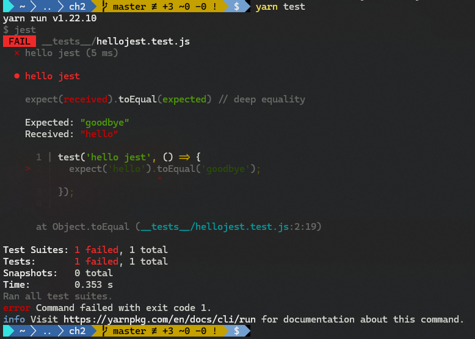
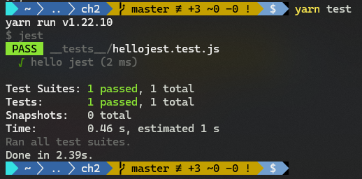
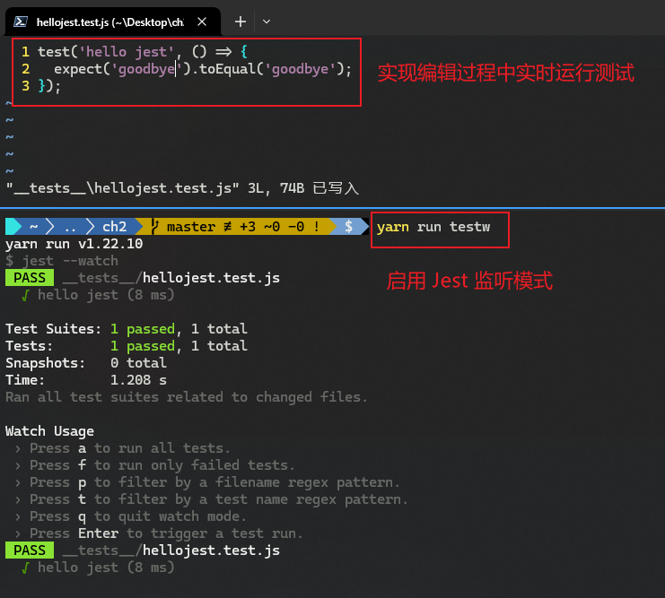
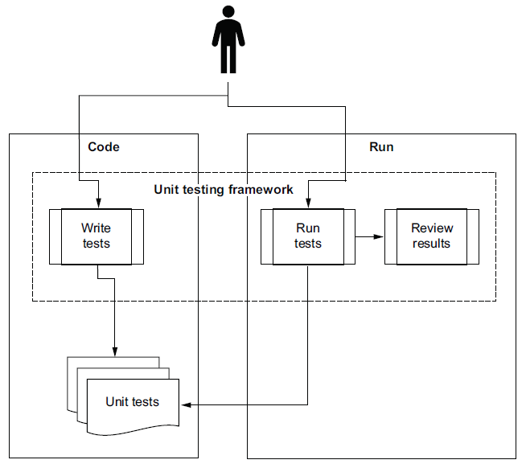
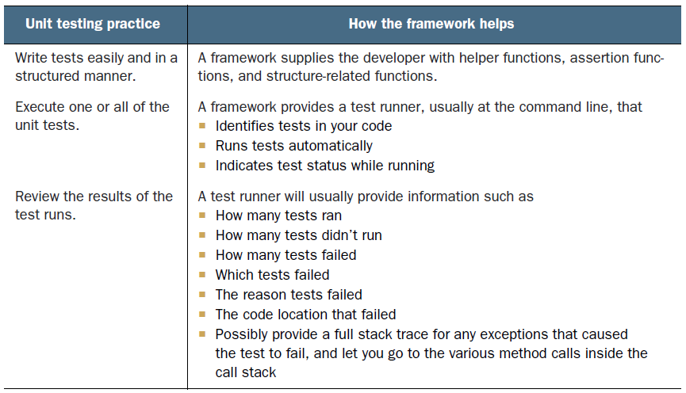
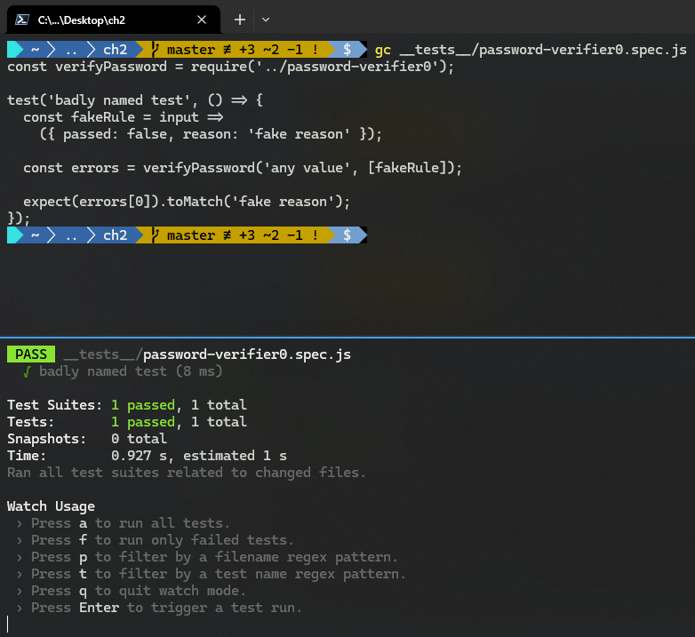
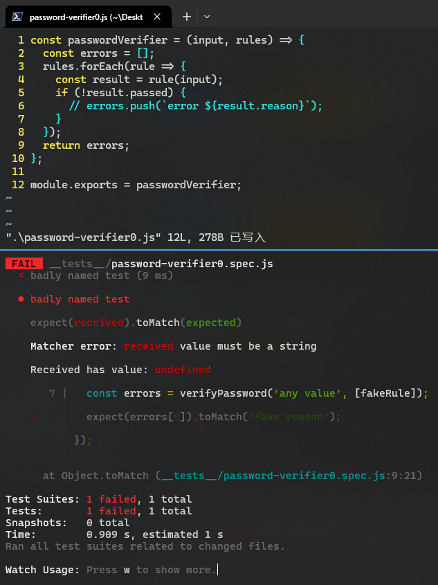
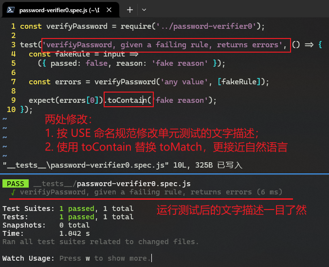

# 第 2 章 第一个单元测试 A first unit test


> **本章概要**
>
> - 用 `Jest` 编写第一个单元测试
> - 测试结构与命名约定
> - 使用断言库（assertion library）
> - 重构测试代码并减少代码冗余

本章介绍 `Jest` 的基本用法，为后续单元测试代码的演示做铺垫。


## 2.1 Jest 简介 Introducing Jest

`Jest` 是由 `Facebook` 受测试框架 `Jasmine` 启发而创建的开源测试框架，最初用于前端 `React` 组件的测试。

`Jest` 支持两种测试语法（flavors）：

1. 使用 `test` 原语；
2. 基于 `Jasmine` 语法风格（`describe`、`it` 等）；


### 2.1.1 环境搭建 Preparing our environment

基本要求：

- `npm` 版本在 `v6.10.2` 以上即可。
- 安装 `Git`


### 2.1.2 创建工作目录 Preparing our working folder

搭建命令：

```bash
mkdir ch2
cd ch2
npm init --yes # 或者：yarn init -yes
git init
```

`Jest` 的配置可在其配置文件 `jest.config.js` 中进行，也可在 `node` 项目的配置文件 `package.json` 中进行。


### 2.1.3 安装 Jest（Installing Jest）

安装命令：（项目层面）

```bash
npm install --save-dev jest # 或者：yarn add jest -dev
```

也可以全局安装（不推荐）：（系统层面）

```bash
npm install -g jest
```

实际项目中一般通过 `npm` 命令运行测试，很少使用全局 `jest` 命令。


### 2.1.4 创建测试文件 Creating a test file

`Jest` 查找项目测试文件的默认方式：

1. 若存在 `__tests__` 文件夹，默认将其中所有文件视为测试文件，无视命名规则；
2. 递归查找项目根路径下所有以 `*.spec.js` 或 `*.test.js` 结尾的文件；
3. 在手动配置的路径下查找（详见 `Jest` 官方 [配置文档](https://jestjs.io/docs/configuration)）。

注意：命名时推荐使用 `*.spec.js`；`*.test.js` 可视为 `*.spec.js` 的简化形式。

> **测试文件的存放位置**
>
> 有两种观点：
>
> - 和待测文件放在一起；
> - 单独放在一个测试文件夹中（推荐）。
>
> 具体怎么放没有硬性规定，只是第二种更方便存放其他与测试相关的辅助文件，同时 `Jest` 还支持原文件和测试文件的导航映射。

创建第一个测试文件：

```bash
# 进入项目根目录 (Powershell 环境)
> pwd 
Path
----
C:\Users\ad\Desktop\ch2
# 添加 git 忽略文件
> echo .gitignore > .gitignore; echo node_modules >> .gitignore
# 创建测试文件夹 __tests__
> mkdir __tests__ | Out-Null
# 新建单元测试
> New-Item -Name hellojest.test.js -Path __tests__ | Out-Null
# 编辑测试内容
> Get-Content __tests__/hellojest.test.js
test('hello jest', () => {
  expect('hello').toEqual('goodbye');
});
```


### 2.1.5 运行 Jest 测试 Executing Jest

修改 `package.json` 默认的 `test` 命令脚本，改为 `"jest"`（第 9 行）：

```bash
# 修改 test 脚本
> Get-Content package.json
{
  "name": "ch2",
  "version": "1.0.0",
  "main": "index.js",
  "license": "MIT",
  "scripts": {
    "test": "jest"
  },
  "devDependencies": {
    "jest": "^29.7.0"
  }
}
```

执行命令 `yarn test`：

```bash
# 运行测试
> yarn test
yarn run v1.22.10
$ jest
 FAIL  __tests__/hellojest.test.js
  × hello jest (5 ms)

  ● hello jest

    expect(received).toEqual(expected) // deep equality

    Expected: "goodbye"
    Received: "hello"

      1 | test('hello jest', () => {
    > 2 |   expect('hello').toEqual('goodbye');
        |                   ^
      3 | });
      4 |

      at Object.toEqual (__tests__/hellojest.test.js:2:19)

Test Suites: 1 failed, 1 total
Tests:       1 failed, 1 total
Snapshots:   0 total
Time:        0.353 s
Ran all test suites.
error Command failed with exit code 1.
info Visit https://yarnpkg.com/en/docs/cli/run for documentation about this command.
$ 
```

实测截图：



**图 2.1 执行首个 Jest 测试的运行结果截图**

修改 `hellojest.test.js`：

```bash
> vim __tests__/hellojest.test.js
> gc __tests__/hellojest.test.js
test('hello jest', () => {
  expect('goodbye').toEqual('goodbye');
});
```

再次运行 `yarn test`：



**图 2.2 修改后的测试结果截图（已通过测试）**

此外，还可以启用 `Jest` 监听模式 `jest --watch`，实现边修改边测试（第 11 行）：

```bash
# 添加 Jest 监听模式命令 testw
> vim package.json
> gc package.json
{
  "name": "ch2",
  "version": "1.0.0",
  "main": "index.js",
  "license": "MIT",
  "scripts": {
    "test": "jest",
    "testw": "jest --watch"
  },
  "devDependencies": {
    "jest": "^29.7.0"
  }
}
```

执行 `yarn run testw` 实测效果：



**图 2.3 启用 Jest 监听模式，实现文件编辑过程中实时运行测试**


## 2.2 测试库、断言库、运行工具、报表工具 The library, the assert, the runner, and the reporter

`Jest` 在测试中充当的角色：

1. 测试工具库（*test library*）
2. 断言库（*assertion library*）：即 `expect` 语句的使用；
3. 测试运行工具（*test runner*）
4. 测试报表工具（*test reporter*）


## 2.3 单元测试框架的作用

主要作用有：

1. 统一的结构化设计（*structure*）：因为开源，不用重复造轮子，人人都能上手
2. 可复用性强（repeatability）：复用性贯穿测试的全流程：编写、执行、报错、结果报告……
3. 可信度高且省时（*Confidence and time savings*）：自己手写的框架不太可靠，出错几率大，分散注意力。
4. 增进共同理解（*Shared understanding*）：（团队场景）通过测试，则表明任务完成



**图 2.4 借助单元测试框架，单元测试写成代码后，可通过 IDE 内的测试运行工具或命令行运行，开发人员或自动构建流程则可以通过测试报告工具（导出文本或 IDE 控制台打印）查看测试结果**



**图 5 测试框架的作用：帮助开发人员编写和执行测试并审查结果**

翻译过来就是：

**表 2.1：测试框架在测试的编写、测试、审查阶段为开发者提供的具体帮助**

|   单元测试实践   | 框架提供的帮助                                               |
| :--------------: | :----------------------------------------------------------- |
| **编写测试用例** | 为开发者提供辅助函数（helper functions）、断言功能、以及 **结构化设计的** 功能函数。 |
|   **运行测试**   | 框架提供运行工具（通常为命令行），可以——<br/>1. 识别代码中的测试用例；<br/>2. 自动运行测试；<br/>3. 在运行时显示测试状态。 |
| **查看测试结果** | 内置的测试运行工具通常会提供以下信息——<br/>1. 有多少测试运行了；<br/>2. 有多少测试没有运行；<br/>3. 有多少测试运行失败；<br/>4. 具体哪些测试失败了；<br/>5. 测试失败的原因；<br/>6. 测试失败的代码位置；<br/>7. 给出可能导致测试失败的任何异常的完整堆栈跟踪信息，以便查看调用堆栈内的相关方法调用情况。 |


> [!warning]
>
> **注意**
>
> 使用单元测试框架，**并不能确保** 编写的测试具有可读性、可维护性或可信性，**也不能确保** 它们涵盖了想测试的所有逻辑！！！


### 2.3.1 xUnit 框架 The xUnit frameworks

`xUnit` 是 `Visual Basic` 时代大多数单元测试框架的统称，它的框架理念源自 `SUnit`，即 `Smalltalk` 的单元测试框架。

单元测试框架通常以构建它的语言的首字母来命名——

- `C++`：`CppUnit`
- `Java`：`JUnit`
- `.NET`：`NUnit` 与 `xUnit`
- `Haskell`：`HUnit`

大部分情况下是这样，只有少数例外（比如本书用的 `Jest`，哈哈）。


### 2.3.2 xUnit、TAP 及 Jest 的结构 xUnit, TAP, and Jest structures

除了命名风格的一致外，测试的结构（用例编写与结果输出等）也要统一。比如 `xUnit` 框架的测试报告就是 XML 格式的，并且至今仍广泛应用与大多数构建工具内。例如 `Jenkins` 就提供了相关插件支持 XML 格式的测试结果。

鉴于大部分静态语言的单元测试框架都是基于 `xUnit` 来建模的，这就意味着一旦学会其中一种，就能触类旁通其他框架。

测试报告结构的统一最后是由一个称为 **TAP** 的协议来实现的，全称为 `Test Anything Protocol`，最初应用于 `Perl` 语言的测试框架，由 **Dave Hampton** 于 2001 年设计。现如今已全面覆盖 `C`、`C++`、`Python`、`PHP`、`Perl`、`Java`、`JavaScript` 等主流编程语言。具体到 `JavaScript`，**TAP** 也是久负盛名的测试框架，原生支持 **TAP** 协议。

严格来说，`Jest` 既不属于 `xUnit` 架构，也不属于 `TAP` 框架。`Jest` 的默认输出不符合二者的标准。但由于 `xUnit` 仍是构建环节的主流测试框架，`Jest` 也提供了 `jest-xunit` 的 `npm` 模块来予以支持；若要基于 `TAP` 输出内容，则使用 `jest-tapreporter` 模块。报告格式的切换配置在 `jest.config.js` 中完成。


## 2.4 示例项目：密码校验器

全书将基于一个密码校验的示例项目，层层递进来介绍单元测试的相关话题。该项目用于构建一个密码验证工具库。起初只有一个 `verifyPassword()` 函数，其中自定义校验规则 `rules` 的结构如下：

```json
{
  passed: Boolean,
  reason: String
}
```

第 0 版实现很简单（`ch2/password-verifier0.js`）：

```js
const verifyPassword = (input, rules) => {
    const errors = [];
    rules.forEach(rule => {
        const result = rule(input);
        if (!result.passed) {
            errors.push(`error ${result.reason}`);
        }
    });
    return errors;
};
```


## 2.5 创建第一个单元测试

### 2.5.1 代码实战

函数 `verifyPassword` 对应的单元测试也很简单：

```js
test('badly named test', () => {
  const fakeRule = input =>
    ({ passed: false, reason: 'fake reason' });
  const errors = verifyPassword('any value', [fakeRule]);
  expect(errors[0]).toMatch('fake reason');
});
```

实战演练：

```bash
# （Powershell 环境）
> (pwd).Path
C:\Users\ad\Desktop\ch2
# 删除上一章无关内容
> rm __tests__/hellojest.test.js
# 新增第0版密码校验函数
> vim password-verifier0.js
> cat password-verifier0.js
const passwordVerifier = (input, rules) => {
  const errors = [];
  rules.forEach(rule => {
    const result = rule(input);
    if (!result.passed) {
      errors.push(`error ${result.reason}`);
    }
  });
  return errors;
};

module.exports = passwordVerifier;
# 新增测试用例
> vim __tests__/password-verifier0.spec.js
> cat __tests__/password-verifier0.spec.js
const verifyPassword = require('../password-verifier0');

test('badly named test', () => {
  const fakeRule = input =>
    ({ passed: false, reason: 'fake reason' });

  const errors = verifyPassword('any value', [fakeRule]);

  expect(errors[0]).toMatch('fake reason');
});
# 运行 Jest 本地测试
> yarn run testw
```

运行结果：



**图 6 启用 Jest 监听模式、并运行第 0 版 verifyPassword 函数的首个单元测试的运行结果**

如果注释掉原函数中数组 `errors` 的 `push` 操作，则测试报错：



**图 7 注释掉原函数对错误原因的记录逻辑，则测试报错（符合预期）**


### 2.5.2 ~ 2.5.4 `AAA` 模式与 `USE` 命名规范

刚才的测试结构，称为 **准备-执行-断言（Arrange-Act-Assert）** 模式，即 `AAA` 模式 ——

- **Arrange（准备）**：设置所需环境和数据（创建对象、初始化变量等）
- **Act（执行）**：调用要测试的功能或方法
- **Assert（断言）**：验证执行结果是否符合预期（检查返回值或状态等）

刚才的测试在命名方面很糟糕，好的命名应该一目了然测试的目的。推荐使用 `USE` 命名规范来给单元测试命名，它由三个部分构成 ——

- **U：被测的工作单元（The unit of work under test）**：本例即为 `verifyPassword` 函数；
- **S：被测单元的场景或输入内容（The scenario or inputs to the unit）**：即给定的无法通过的校验规则；
- **E：预期行为或退出点（The expected behavior or exit point）**：返回带报错原因的校验结果（未通过）

按照 `USE` 命名规则修改的单元测试：



**图 8 按照 USE 命名规范重构的单元测试描述及运行结果**

注意第 9 行：改为 `toContain` 后，既更贴近自然语言表述，更能提高测试的容错率（包含几个关键词即可）。

因为字符串也是某种意义上的用户界面，人们关心的重点是它传递的信息，而不是哪些枝端末节的空格、制表符、星号、换行……

测试最理想的状态，应该是仅当代码存在错误时测试才不通过，尽量降低误报率。这便是改为 `toContain` 的目的所在。


### 2.5.5~2.5.6 describe() 方法的使用  Using describe()

`Jest` 的 `describe()` 函数为单元测试提供了更丰富的结构，可将 `USE` 规范中的三个部分拆分开，既为读者提供了逻辑意义上的上下文，同时也为单元测试提供了更细分的作用域：

```js
describe('verifiyPassword', () => {
  test('given a failing rule, returns errors', () => {
    const fakeRule = input =>
      ({ passed: false, reason: `${input} fake reason` });

    const errors = verifyPassword('any value', [fakeRule]);

    expect(errors[0]).toContain('fake reason');
  });
});
```

这里作了四处修改：

1. 使用 `describe()` 嵌套 `test()` 的结构；
2. `USE` 规范中的 `U` 移至 `describe` 方法；
3. `AAA` 模式之间使用空行隔开；
4. 报错原因中包含 `input` 参数，提示信息更丰富。

也可以在 `describe` 中嵌套 `describe`，完全拆开 `USE` 的三个部分（前三行）：

```js
describe('verifiyPassword', () => {
  describe('with a failing rule', () => {
    test('returns errors', () => {
      const fakeRule = input =>
        ({ passed: false, reason: `${input} fake reason` });

      const errors = verifyPassword('any value', [fakeRule]);

      expect(errors[0]).toContain('fake reason');
    });
  });
});
```

此时，单元测试的层次更加丰富，暗含在特定场景下，可能存在多个预期行为的意味。此时可以将通用部分（如 `fakeRule`）提取到中间的 `describe` 上下文，变为：

```js
describe('verifiyPassword', () => {
  describe('with a failing rule', () => {
    const fakeRule = input =>
      ({ passed: false, reason: `${input} fake reason` });
    test('returns errors', () => {
      const errors = verifyPassword('any value', [fakeRule]);
      expect(errors[0]).toContain('fake reason');
    });
    // test(...);
  });
});
```

这样一来，对于存在多个出口点的工作单元，每一个出口点都能对应一个独立的单元测试，这是符合单元测试整体设计的。


### 2.5.7 it() 函数的使用 The it() function

`describe` 函数常与 `it` 函数搭配，在英语语境下可读性更好：

```js
describe('verifiyPassword', () => {
  describe('with a failing rule', () => {
    it('returns errors', () => {
      // ...
    });
  });
});
```


### 2.5.8 Jest 的两种测试风格 Two Jest flavors

`Jest` 支持两种主要的测试编写方式——

1. 简洁的 `test` 风格；
2. 更注重文字描述（`describe-driven`）的风格（即分层写法）；

后者很大程度上归功于 `Jest` 的前身 —— `Jasmine` 框架。这种风格最早可以追溯到 `Ruby` 中的著名测试框架 `RSpec Ruby`，也被成为 `BDD` 风格，即 **行为驱动开发（*behavior-driven development*）**。

两种风格的选择都是个人喜好，没有严格的新旧好坏之分。

> **关于 BDD 的历史掌故**
>
> `BDD` 与 `TDD` 无关。当年 **Dan North** 发明 `BDD` 主要是想用场景叙事和案例来描述应用程序的运行原理，目标人群也主要是非技术人员，比如产品所有人、客户等。`RSpec` 受 `RBehave` 的启发，将这个叙事驱动（`story-driven`）的方法推广出来，其他类似的框架也相继问世，比如著名的 `BDD` 框架 `Cucumber`。`Cucumber` 使用 `Gherkin` 语言编写测试场景，支持多种编程语言：`Ruby`、`Java`、`JavaScript`、`C#` 等，通常包括以下几个部分：
>
> - **Feature**：功能描述
> - **Scenario**：测试场景
> - **Given**：前置条件
> - **When**：执行的操作
> - **Then**：预期的结果
>
> 例如（详见 `Cucumber` 官网：[https://cucumber.io/](https://cucumber.io/)）：
>
> ```gherkin
> Feature: User login
> 
>   Scenario: Successful login
>     Given a user with username "user1" and password "password123"
>     When the user logs in
>     Then the user should see the dashboard
> ```
>
> 然而现实却与 `BDD` 的设计初衷完全背道而驰 —— 绝大部分测试框架都是开发人员在使用和维护，跟非技术方半毛钱关系都没有​（笑死）。现在的 `BDD` 更多是作为测试框架的某种语法糖来使用，几乎从未在利益相关方之间促成真正的沟通与交流。它们更多是被当成一种便于开发人员运行自动化测试的指定工具。时至今日，`Cucumber` 也有了类似的迹象。


### 2.5.9 再次重构密码校验器 Refactoring the production code

接着给示例项目引入状态，实现规则配置和运行校验的分离。这里用的是 `ES6` 的 `class` 语法糖：

```js
class PasswordVerifier1 {
  constructor () {
    this.rules = [];
  }

  addRule (rule) {
    this.rules.push(rule);
  }

  verify (input) {
    const errors = [];
    this.rules.forEach(rule => {
      const result = rule(input);
      if (result.passed === false) {
        errors.push(result.reason);
      }
    });
    return errors;
  }
}
```

此时，工作单元的范围扩大了，之前的测试逻辑也需要同步调整，规则配置和结果校验需要分别调用 `addRule(rule)` 方法和 `verify(input)` 方法（第 4、10、11 行）：

```js
describe('PasswordVerifier', () => {
  describe('with a failing rule', () => {
    it('has an error message based on the rule.reason', () => {
      const verifier = new PasswordVerifier1();
      const fakeRule = input => ({
        passed: false,
        reason: `${input} fake reason`
      });

      verifier.addRule(fakeRule);
      const errors = verifier.verify('any value');

      expect(errors[0]).toContain('fake reason');
    });
  });
});
```

由于引入了状态，代码间产生了耦合，这些状态仅限于测试内部使用，不能暴露出去。此时若要在同一场景下编写多个测试，比如验证错误的数量为 1，貌似加一句断言即可（第 3 行）：

```js
verifier.addRule(fakeRule);
const errors = verifier.verify('any value');
expect(errors.length).toBe(1);  // A new assertion
expect(errors[0]).toContain('fake reason');
```

但这样写非但与前面介绍的单元测试的定义不符，在第 3 行报错时还容易漏掉它后面的测试。

有人可能觉得小题大作，测试第 4 行时注释掉第 3 行不就行了，干嘛这么较真？这种做法在 **Gerard Meszaros** 所著的《`xUnit` 测试模式》（*xUnit Test Patterns*）一书中称为 **断言轮盘（*assertion roulette*）**，容易造成大量混乱和误报情况：某些功能点未通过，但实际可能通过了；反之亦然。

正确的写法，应该是按出口点（`exit point`）编写独立的单元测试用例：

```js
describe('v3 PasswordVerifier', () => {
  describe('with a failing rule', () => {
    it('has an error message based on the rule.reason', () => {
      const verifier = new PasswordVerifier1();
      const fakeRule = input => ({
        passed: false,
        reason: 'fake reason'
      });

      verifier.addRule(fakeRule);
      const errors = verifier.verify('any value');

      expect(errors[0]).toContain('fake reason');
    });
    it('has exactly one error', () => {
      const verifier = new PasswordVerifier1();
      const fakeRule = input => ({
        passed: false,
        reason: 'fake reason'
      });

      verifier.addRule(fakeRule);
      const errors = verifier.verify('any value');

      expect(errors.length).toBe(1);
    });
  });
});
```

这样，**断言轮盘** 的问题倒是解决了，却导致了严重的代码冗余。于是引出下一节的重点：`beforeEach()` 路由。
