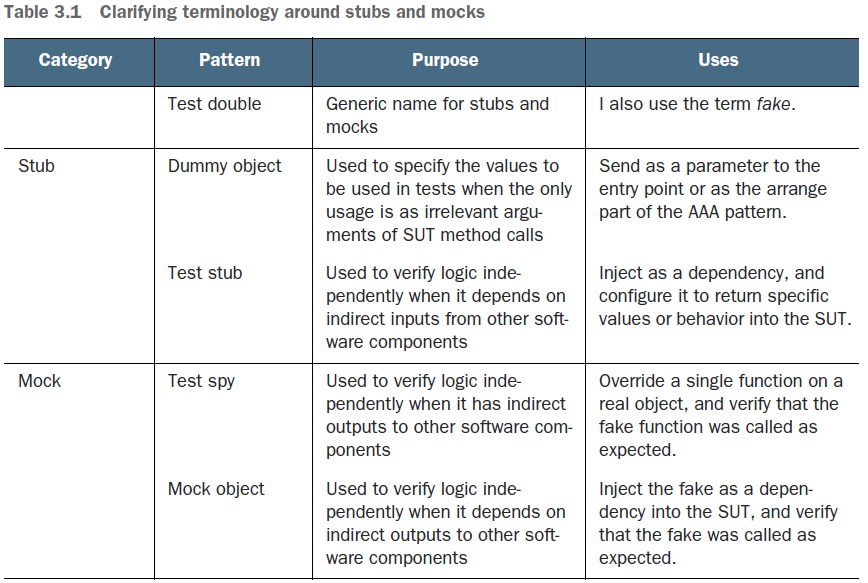

# 第 3 章 用 stub 桩断开依赖 Breaking dependencies with stubs

---

## 3.0 概述

第3~6章为本书第二部分——核心技能篇，主要介绍真实场景中编写测试所必需的核心测试与重构技术——

- 第三章：研究 `stub` 桩在打破依赖方面的具体用法，利用重构让代码更易于测试，并介绍 `seam` 缝的相关知识；
- 第四章：讨论 `mock` 对象与交互测试（interaction tests），了解 `mock` 和 `stub` 的区别，并介绍伪对象（`fakes`）相关知识；
- 第五章：介绍隔离框架（isolation frameworks，也称 mocking frameworks，即模拟框架），并学习手写 `mock` 对象与 `stub` 桩中代码冗余问题的处理方法；
- 第六章：探讨异步代码，如 `Promise` 期约、`timer` 定时器、`events` 事件及其测试的写法。

> **本章概要**
>
> - 依赖的类型：`mock`、`stub` 及其他
> - 使用 `stub` 桩的原因
> - 基于函数式编程的依赖注入实现
> - 基于模块化设计的依赖注入实现
> - 基于面向对象编程的依赖注入实现

前两章介绍的测试只涉及两种情况：

- 出口点为返回值的情况；
- 出口点存在状态的情况；

本章学习第三种情况：出口点存在第三方依赖的情况。

**依赖（Dependency）** 的定义：代码中依赖的所有外部事物，统称为依赖项（dependencies）。比如时间依赖、异步代码、文件系统依赖以及网络依赖等。也可以是任何配置非常困难或执行极其耗时的事物。

引入依赖将加大测试编写和复用的难度，使测试变得不再稳定（flaky）。


## 3.1 依赖的类型 Types of dependencies

总共分两大类——

- **输出型依赖（Outgoing dependencies）**：代表工作单元内的某个出口点（exit point），如调用日志、写入数据库、发送电邮、告知 API 或 Webhook 相关状态等。这些动词（调用、发送、告知），都是从工作单元向外流动，适用于“一发即弃（`fire-and-forget`）”的场景。
- **输入型依赖（Incoming dependencies）**：所有非出口点的依赖项都算输入型依赖。它不表示工作单元的终止，只是为工作单元提供特定的数据或行为，如数据库查询结果、文件系统的文件内容、网络响应等。输入型依赖都是被动型数据，并通常作为先前操作的结果引入工作单元。

示意图如下：


**图 3.1 输出型依赖（左）与输入型依赖（右）示意图**

某些依赖项既是输出型依赖，又是输出型依赖。虽不常见，但确实存在，如调用外部 API 告知某消息后，该 API 接口的响应内容（成功或失败）。



**表 3-1 核心易混概念辨析——`Stub` 与 `Mock`**

|   大类    |         表现形式          | 目的                                                         | 使用场景                                                     |
| :-------: | :-----------------------: | ------------------------------------------------------------ | ------------------------------------------------------------ |
|           | `Test double`（测试替身） | 泛指 `stub` 和 `mock`                                        | 通常也称为 *`fake`* 伪对象                                   |
|  Stub 桩  |  `Dummy object` 虚拟对象  | 指代测试中使用的指，其唯一用途是作为 `SUT` 方法调用的 **无关参数** | 以参数形式发送至入口点，或作为 `AAA` 模式的准备阶段发送。    |
|           |    `Test stub` 测试桩     | 当某逻辑 **依赖于** 其他组件的 **间接输入** 时，用于独立验证该逻辑 | 作为依赖项注入上下文，并对 `SUT` 返回特定的值或某种行为。    |
| Mock 模拟 |    `Test spy` 测试间谍    | 当某逻辑存在往其他组件 **间接输出** 时，用于独立验证该逻辑   | 在实际对象上重写（override）一个函数，并验证该函数是否按预期那样被调用。 |
|           |  `Mock object` 模拟对象   | 当某逻辑 **依赖于** 其他组件的间接输出时，用于独立验证该逻辑 | 向 `SUT` 注入伪代码，并验证其是否按预期那样被调用。          |

注：`SUT` 即 **subject, system, or suite under test**，即主题、系统或测试套件。三者均为编写的测试所针对的测试对象。详见第一章笔记。

二者的区别还可以这样理解：

- `Stub` 桩会断开输入型依赖项（即间接输入），它为被测代码提供虚拟的行为或数据，在测试中 **无需** 对其断言。一个测试可以有多个 `Stub` 桩；
- `Mocks` 模拟断开输出型依赖项（即间接输出），它是测试中被调用的假模块、假对象、假函数，在测试中 **需要** 对其断言。由于 `Mocks` 可表示单元测试中的出口点（exit point），因此建议每个测试只出现一个 `Mock`。

`Stub` 与 `Mock` 的概念截然不同，断然不可混为一谈。如果二者不明确，可使用 `test double` 或 `fake` 来泛指。


## 3.2 使用 stub 桩的原因

在第二章示例函数 `verifyPassword` 的基础上新增一个功能：周末不运行校验。这里引入第三方模块 `moment.js` 来简化原生 JS 的相关日期操作，具体实现如下：

```js
const moment = require('moment');
const SUNDAY = 0; const SATURDAY = 6;

const verifyPassword = (input, rules) => {
  const dayOfWeek = moment().day();
  if ([SATURDAY, SUNDAY].includes(dayOfWeek)) {
    throw Error("It's the weekend!");
  }
  // more code goes here...
  // return list of errors found..
  return [];
};
```

在创建对应的单元测试：

```js
const moment = require('moment');
const { verifyPassword } = require('./password-verifier-time00');
const SUNDAY = 0, SATURDAY = 6;

describe('verifier', () => {
  const TODAY = moment().day();

  // test is always executed, but might not do anything
  test('on weekends, throws exceptions', () => {
    if ([SATURDAY, SUNDAY].includes(TODAY)) {
      expect(() => verifyPassword('anything', []))
        .toThrowError("It's the weekend!");
    }
  });

  // test is not even executed on week days
  if ([SATURDAY, SUNDAY].includes(TODAY)) {
    test('on a weekend, throws an error', () => {
      expect(() => verifyPassword('anything', []))
        .toThrow("It's the weekend!");
    });
  }
});
```

上述单元测试代码中，第 6 行通过 `moment` 依赖得到当天的星期数，然后在第 10 行和第 17行分别尝试在单元测试内部和外部检查日期值。

本段代码存在的问题 ——

1. 测试内部无法控制日期和时间（均由 `moment` 接管）；
2. 只能使用 `moment` 提供的 **正确** 日期和时间值；
3. 只能使用真实日期（运行测试当天的星期），无法模拟周六和周日；
4. 测试变得不稳定：分别在工作日和周末运行测试，代码完全不变的情况下，得到的结果并不完全一致；


### 3.2.1 本地环境实测

运行以下命令实测：

```bash
# (under PowerShell environment)
# 1. Navigate to project root (ch3)
> (date).DayOfWeek
Monday
> (pwd).Path
C:\Users\ad\Desktop
> mkdir ch3 | Out-Null
> cd ch3
# 2. Init project via yarn
> yarn init -yes
> yarn add moment
> yarn add -D jest
# 3. Init local git repo
> git init
> echo '.gitignore' >> .gitignore
> echo 'node_modules' >> .gitignore
# 4. Add test scripts
> vim package.json
> cat package.json # L25 ~ L28
{
  "name": "ch3",
  "version": "1.0.0",
  "main": "index.js",
  "license": "MIT",
  "scripts": {
    "test": "jest",
    "testw": "jest --watch"
  },
  "dependencies": {
    "moment": "^2.30.1"
  },
  "devDependencies": {
    "jest": "^29.7.0"
  }
}
# 5. Add SUT
> vim password-verifier-time00.js
> cat password-verifier-time00.js
const moment = require('moment');
const SUNDAY = 0, SATURDAY = 6;

const verifyPassword = (input, rules) => {
  const dayOfWeek = moment().day();
  if([SATURDAY, SUNDAY].includes(dayOfWeek)) {
    throw Error("It's the weekend!");
  }
  // more code goes here ...
  // return list of errors found ...
  return [];
};

module.exports = {
  verifyPassword,
};
# 6. Add initial unit test
> mkdir __tests__ | Out-Null
> vim __tests__/password-verifier-time00.spec.js
> cat __tests__/password-verifier-time00.spec.js
const moment = require('moment');
const { verifierPassword } = require('../password-verifier-time00');
const SUNDAY = 0, SATURDAY = 6;

describe('verifier', () => {
  const TODAY = moment().day();

  // test is always executed, but might not do anything
  test('on weekends, throws exceptions', () => {
    if([SATURDAY, SUNDAY].includes(TODAY)) {
      expect(() => verifyPassword('anything', []))
        .toThrowError("It's the weekend!");
    }
  });

  // test is not even executed on week days
  if([SATURDAY, SUNDAY].includes(TODAY)) {
    test('on a weekend, throw an error', () => {
      expect(() => verifyPassword('anything', []))
        .toThrow("It's the weekend!");
    });
  }

});
# 7. Create 1st commit
> git add *
> git commit -m 'introduce moment dependency'
# 8. Execute the test
> yarn test
yarn run v1.22.10
$ jest
 PASS  __tests__/password-verifier-time00.spec.js
  verifier
    √ on weekends, throws exceptions (2 ms)

Test Suites: 1 passed, 1 total
Tests:       1 passed, 1 total
Snapshots:   0 total
Time:        0.456 s, estimated 1 s
Ran all test suites.
Done in 1.09s.
```

实测结果：


**图 2 只运行成功一个测试（今天非周末）**

由截图可知，测试运行受制于当前的实际日期（今天星期一），第二个单元测试没能运行。


## 3.3 常用的 stub 桩注入方案

本节算是本章后续各小节的总纲，先介绍最简单的 `stub` 桩注入方案——参数注入法；然后对本章出现的其他几个测试专用术语进行了对比（依赖、控制、控制反转、依赖注入、Seam 缝）。

`Stub` 桩的常用注入方案：

- 参数注入法（basic parameterization）
- 基于函数式编程的注入方案（Functional approaches）
  - 函数作参数（Function as parameter）
  - 函数部分求值（即柯里化）Partial application (currying)
  - 工厂函数（Factory functions）
  - 构造函数（Constructor functions）
- 基于模块化设计的注入方案（Modular approach）
  - 模块注入法（Module injection）
- 基于面向对象编程的注入方案（Object-oriented approach）
  - 通过类的构造函数注入（Class constructor injection）
  - 以对象为参数注入（Object as parameter (aka duck typing)）
  - 以通用接口为参数注入（Common interface as parameter (via TypeScript)）


### 3.3.1 参数注入法实现

其实就是改造原函数，新增一个 `currentDay` 参数（L1、L2）：

```js
const verifyPassword2 = (input, rules, currentDay) => {
  if ([SATURDAY, SUNDAY].includes(currentDay)) {
    throw Error("It's the weekend!");
  }
  // more code goes here...
  // return list of errors found..
  return [];
};
```

单元测试相应调整为（L4）：

```js
const SUNDAY = 0, SATURDAY = 6, MONDAY = 1;
describe('verifier2 - dummy object', () => {
  test('on weekends, throws exceptions', () => {
    expect(() => verifyPassword2('anything', [], SUNDAY))
      .toThrowError("It's the weekend!");
  });
});
```

此时时间的控制权转交给了函数的调用方（即单元测试）。这个注入的参数的准确名称叫 `dummy`，仅仅代表一个没有任何行为的数据，本例也可以称它为一个 `stub` 桩。

这种写法其实是依赖注入（Dependency Injection）的一种具体形式。依赖注入是 **Robert C. Martin** 大佬于 2000 年在论文《设计原则与设计模式》描述的 `SOLID` 五大原则之一。相关话题将在第 8 章重点讨论。

上述改造的好处：

1. 可以模拟任一星期值；
2. 无需导入 `moment` 依赖，让原函数变为 **纯函数**；
3. 使用 `currentDay` 来模拟传入 `SUT` 的某些输入值与行为；

该方案示意图：


**图 3 给时间依赖项注入一个 stub 桩的实现方案示意图**


### 3.3.2 另外几个重要概念


**图 4 本章的另外几个重要术语辨析（原图）**

同步翻译过来就是下面这张表格内容：

**表 3-2 本章出现的另外几个重要术语说明**

|               术语               | 说明                                                         |
| :------------------------------: | ------------------------------------------------------------ |
|       Dependencies（依赖）       | 确保测试正常运行、但让代码维护面临挑战的那些外部因素，都算依赖项，因为无法在测试中控制它们。常见依赖包括时间、文件系统、网络、随机值等。 |
|         Control（控制）          | 能够指示依赖的行为。谁创建了依赖，谁就拥有对它的控制权，因为他们在测试代码使用依赖前可以对其进行配置。3.2 小节示例中的测试无法控制时间，因为时间的控制权在待测模块手中。该模块总是按当前日期和时间执行，这迫使单元测试也必须使用当前时间，从而丧失测试的一致性。而本节示例通过引入 `currentDay` 参数实现了对时间的控制权反转，使得测试可以使用硬编码的时间运行，从而让测试变得更加稳定。 |
| Inversion of control（控制反转） | 将依赖的创建逻辑从 `SUT` 内部移除，并将相关逻辑放到外部来夺回控制权。在本节示例中，参数注入法就是控制反转的一种具体表现形式。 |
| Dependency injection（依赖注入） | 将依赖通过接口传给内部代码的行为。注入依赖的地方称为 **注入点（injection point）**。本例中使用了参数注入点。该注入位置的另一个专用术语叫 **缝隙（seam）**。 |
|           Seam（缝隙）           | 发音为 `/s-ee-m/`，由 **Michael Feathers** 在《重构历史遗留代码》（Pearson 出版社 2004 年出版）一书中首次提出。<br/>`Seam` 是两个软件组件的接口，通过该接口可以注入其他依赖项。在不直接修改原代码的情况下改变程序行为的位置就叫 **缝隙**。常见缝隙包括参数、函数、模块加载器、函数重写等；在 `OOP` 中则包括类接口、公共抽象方法等。 |

`Seam` 缝隙在生产环境中对单元测试的可维护性和可读性起着至关重要的作用。在 `SUT` 中，修改并注入某行为或自定义数据越容易，测试代码的书写、阅读和后续维护就越简单（第 8 章将详述）。