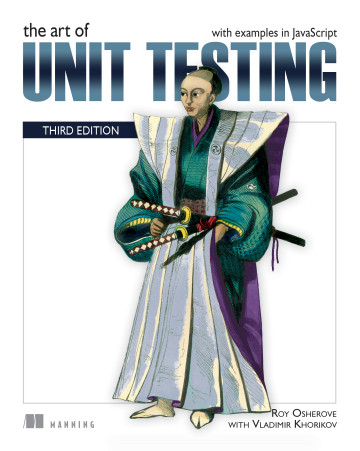

# 《The Art of Unit Testing, Third Edition》Learning Notes


## 1. Profiles



|    **Title**    | **The Art of Unit Testing, Third Edition** [ISBN: 9781617297489] |
| :-------------: | :----------------------------------------------------------: |
|   **Author**    |           **Roy Osherove with Vladimir Khorikov**            |
| **Publication** |                     **Manning, 2024.02**                     |
|    **Pages**    |                           **288**                            |

> **Introduction 简介**
>
> **Unit testing is more than just a collection of tools and practices—it’s a state of mind! This bestseller reveals the master’s secrets for delivering robust, maintainable, and trustworthy code.
> 单元测试不仅仅是工具和实践的集合，更是一种思想境界！这本畅销书揭示了大师们交付健壮、可维护和可信代码的秘诀。**
>
> Thousands of developers have learned to hone their code quality under the tutelage of *The Art of Unit Testing*. This revised third edition updates an international bestseller to reflect modern development tools and practices, as well as to cover JavaScript.
> 成千上万的开发人员在 **《单元测试的艺术》** 的指导下磨练了自己的代码质量。修订后的第三版更新了这本国际畅销书，以反映现代开发工具和实践，并涵盖 JavaScript。
>
> Inside *The Art of Unit Testing, Third Edition* you will learn how to:
> 在 **《单元测试的艺术》** 第三版中，您将学习到如何进行单元测试：
>
> - Create readable, maintainable, and trustworthy tests
>   创建可读、可维护和可信的测试
> - Work with fakes, stubs, mock objects, and isolation frameworks
>   使用伪造、存根、模拟对象和隔离框架
> - Apply simple dependency injection techniques
>   应用简单的依赖注入技术
> - Refactor legacy code with confidence
>   自信地重构遗留代码
> - Test both frontend and backend code
>   测试前台和后台代码
>
> Effective unit tests streamline your software development process and ensure you deliver consistent high-quality code every time. With practical examples in JavaScript and Node, this hands-on guide takes you from your very first unit tests all the way to comprehensive test suites, naming standards, and refactoring techniques. You’ll explore test patterns and organization, working with legacy code and even “untestable” code. The many tool-agnostic examples are presented in JavaScript and carefully designed so that they apply to code written in any language.
> 有效的单元测试可以简化软件开发流程，确保您每次都能交付一致的高质量代码。通过 JavaScript 和 Node 中的实际示例，本实践指南将带您从最开始的单元测试，一直到综合测试套件、命名标准和重构技术。您将探索测试模式和组织，处理遗留代码，甚至是 "不可测试 "的代码。许多与工具无关的示例都是用 JavaScript 编写的，并且经过精心设计，适用于用任何语言编写的代码。
>
> **about the technology 关于技术**
>
> The art of unit testing is more than just learning the right collection of tools and practices. It’s about understanding what makes great tests tick, finding the right strategy for each unique situation, and knowing what to do when the testing process gets messy. This book delivers insights and advice that will transform the way you test your software.
> 单元测试的艺术不仅仅是学习正确的工具和实践。它需要了解是什么让优秀的测试变得如此重要，为每种独特的情况找到正确的策略，并知道当测试过程变得混乱时该怎么办。本书提供的见解和建议将改变您测试软件的方式。
>
> **about the book 关于本书**
>
> *The Art of Unit Testing, Third Edition* shows you how to create readable and maintainable tests. It goes well beyond basic test creation into organization-wide test strategies, troubleshooting, working with legacy code, and “merciless” refactoring. You’ll love the practical examples and familiar scenarios that make testing come alive as you read. This third edition has been updated with techniques specific to object-oriented, functional, and modular coding styles. The examples use JavaScript.
> **《单元测试的艺术》第三版** 告诉您如何创建可读、可维护的测试。除了基本的测试创建之外，本书还深入探讨了组织范围内的测试策略、故障排除、遗留代码的处理以及 "无情 "的重构。实用的示例和熟悉的场景会让你爱不释手，让测试在阅读中变得生动活泼。第三版更新了面向对象、函数式和模块化编码风格的特定技术。示例使用 JavaScript。


## 2. Outlines

Status available：:heavy_check_mark: (Completed) | :hourglass_flowing_sand: (Working) | :no_entry: (Not Started) | :orange_book: (Finish reading)

| No.  |                        Chapter Title                        |          Status          |
| :--: | :---------------------------------------------------------: | :----------------------: |
|      |                 **Part I: Getting started**                 |                          |
| Ch01 |           [The basics of unit testing](./Ch01.md)           |    :heavy_check_mark:    |
| Ch02 |               [A first unit test](./Ch02.md)                |    :heavy_check_mark:    |
|      |                **Part II: Core techniques**                 |                          |
| Ch03 |        [Breaking dependencies with stubs](./Ch03.md)        | :hourglass_flowing_sand: |
| Ch04 |     [Interaction testing using mock objects](./Ch04.md)     |        :no_entry:        |
| Ch05 |              [Isolation frameworks](./Ch05.md)              |        :no_entry:        |
| Ch06 |         [Unit testing asynchronous code](./Ch06.md)         |        :no_entry:        |
|      |                 **Part III: The test code**                 |                          |
| Ch07 |               [Trustworthy tests](./Ch07.md)                |        :no_entry:        |
| Ch08 |                [Maintainability](./Ch08.md)                 |        :no_entry:        |
|      |               **Part IV: Design and process**               |                          |
| Ch09 |                  [Readability](./Ch09.md)                   |        :no_entry:        |
| Ch10 |         [Developing a testing strategy](./Ch10.md)          |        :no_entry:        |
| Ch11 | [Integrating unit testing into the organization](./Ch11.md) |        :no_entry:        |
| Ch12 |            [Working with legacy code](./Ch12.md)            |        :no_entry:        |


Powershell script for generating markdown files in batch:

```powershell
# Create 12 empty markdown files named Ch##.md:
for($i=1; $i -le 12; $i=$i+1){ New-Item -Name "Ch$('{0:d2}' -f $i).md"; }
```

 
